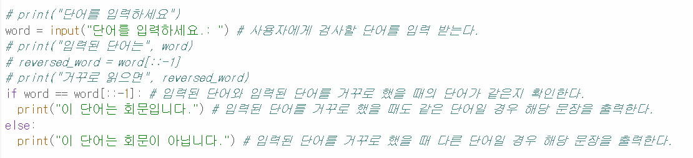
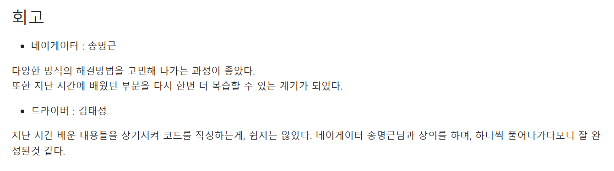

# AIFFEL Campus Online Code Peer Review Templete
- 코더 : 김태성
- 리뷰어 : 최유진


# PRT(Peer Review Template)
- [X]  **1. 주어진 문제를 해결하는 완성된 코드가 제출되었나요?**
    -  
    -  
    주어진 문제를 해결하는 완성된 코드가 제출되었다. 
    단어를 입력하세요.: ㅇㅇㅇ
    이 단어는 회문입니다
    
- [X]  **2. 전체 코드에서 가장 핵심적이거나 가장 복잡하고 이해하기 어려운 부분에 작성된 
주석 또는 doc string을 보고 해당 코드가 잘 이해되었나요?**
    - 
     if word == word[::-1]: 
     이부분이 핵심 코드이다. if문을 사용해 코드를 잘 처리하였다.  
        
- [X]  **3. 에러가 난 부분을 디버깅하여 문제를 해결한 기록을 남겼거나
새로운 시도 또는 추가 실험을 수행해봤나요?**
   -  
    - # print("입력된 단어는", word)
    - # reversed_word = word[::-1]
    - # print("거꾸로 읽으면", reversed_word)
    주석으로 처리해 기록을 남겼다.
        
- [X]  **4. 회고를 잘 작성했나요?**
   - 
    - 느낀점과 배운 점, 배운 지식을 적용하는 회고를 잘 작성하였다. 
        
- [X]  **5. 코드가 간결하고 효율적인가요?**
   -  
    - 간결하고 효율적으로 작성되어 있었다. 그러나 인출한 단어를 거꾸로 출력하는 것은 빠져있는 부분이 아쉬웠음!


# 회고(참고 링크 및 코드 개선)
```
# 우리 팀과 다른 방식으로 코드를 작성해서 새로운 시각으로 볼 수 있었다.
    앞으로 좀 더 깔끔하게 코드를 작성해야겠다고 생각했다.
```
